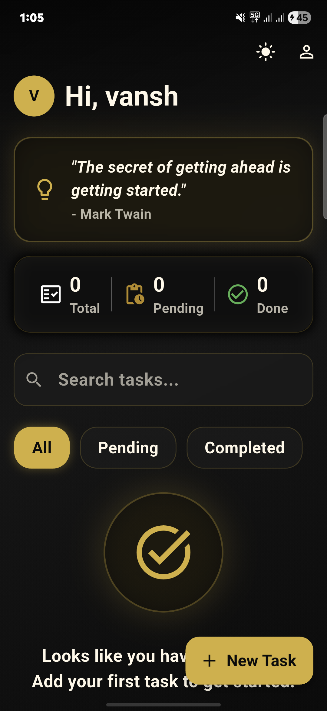
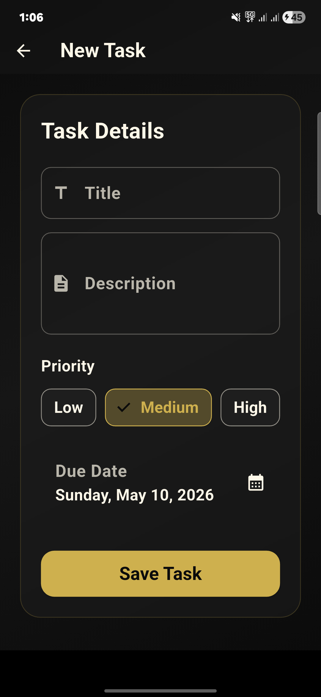
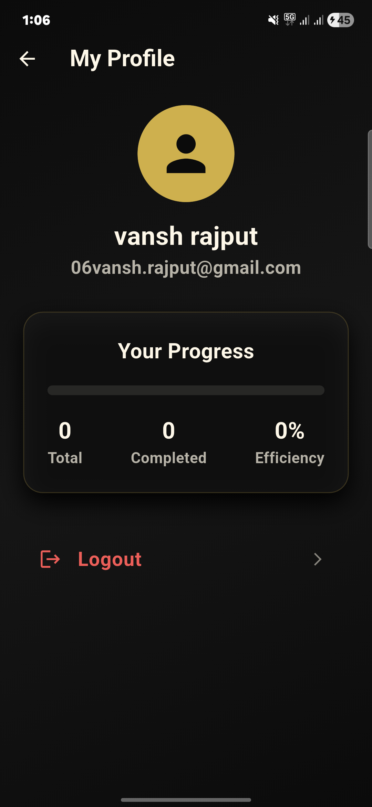
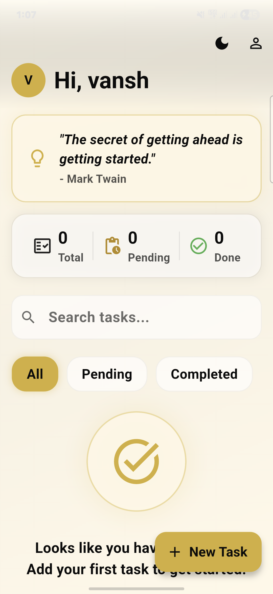

# Flutter Task Manager

A premium task management application with real-time cloud synchronization and an elegant glassmorphism UI.

[]()
[]()
[]()

## Project Overview

This is an internship assignment project demonstrating full-stack mobile development using Flutter and Firebase. The application provides a robust task management system featuring user authentication, real-time Firestore database synchronization, and state management using Provider. A core focus of this project is the UI/UX design, featuring a custom premium black-and-gold glassmorphism theme that seamlessly supports both dark and light modes.


## Screenshots

<p align="center">
  
  
  
  
</p>

## Features

- **Authentication**: Secure user signup, login, and logout using Firebase Authentication, with auth state persistence.
- **Real-Time Sync**: Add, edit, delete, and mark tasks as completed with instant updates via Cloud Firestore.
- **Data Isolation**: User-specific task filtering ensures data privacy and proper multi-user architecture.
- **REST API Integration**: Dynamic motivational quote card fetching daily quotes from a REST endpoint.
- **Premium UI/UX**: 
  - Sophisticated black-and-gold glassmorphism aesthetics.
  - Native dark and light mode adaptation.
  - Smooth scale transitions, hero animations, and pull-to-refresh capabilities.
  - Contextual empty state UI components.

## Tech Stack

| Technology | Purpose  |
| ---------- | -------  |
| **Flutter / Dart**    | Cross-platform framework and language     |
| **Firebase Auth**     | User authentication & state persistence   |
| **Cloud Firestore**   | Real-time NoSQL cloud database            |
| **Provider**          | State management and dependency injection |
| **http / REST APIs**  | Fetching external data (quotes)           |
| **shared_preferences**| Local caching (e.g., theme preferences)   |
| **intl**              | Date formatting                           |

## Project Structure

The project follows a clean, modular architecture to ensure scalability and separation of concerns:

```text
lib/
├── models/         # Data models and serialization (e.g., TaskModel)
├── providers/      # State management (e.g., ThemeProvider)
├── screens/        # UI Views (Login, Home, Profile, AddTask)
├── services/       # Business logic and external calls (AuthService, TaskService)
├── themes/         # Centralized visual definitions (AppTheme)
├── utils/          # Helpers, constants, and custom transitions
├── widgets/        # Reusable UI components (TaskCard, EmptyStateWidget)
└── main.dart       # App entry point
```

## Firebase Setup

To run this project, you must connect it to your own Firebase instance:

1. Create a new project in the [Firebase Console](https://console.firebase.google.com/).
2. Enable **Authentication** (Email/Password provider).
3. Enable **Firestore Database**.
4. Register your Android app with the package name in your `android/app/build.gradle`.
5. Download the `google-services.json` file and place it in the `android/app/` directory.

## Firestore Security Rules

Ensure your Firestore database rules are configured to allow authenticated users to read and write data properly:

```javascript
rules_version = '2';
service cloud.firestore {
  match /databases/{database}/documents {

    match /tasks/{taskId} {
      allow create: if request.auth != null
        && request.resource.data.userId == request.auth.uid;

      allow read, update, delete: if request.auth != null
        && resource.data.userId == request.auth.uid;
    }

    match /users/{userId} {
      allow read, write: if request.auth != null
        && request.auth.uid == userId;
    }
  }
}
```

## Installation and Run

1. Clone the repository:
   ```bash
   git clone [GITHUB_REPO_LINK]
   ```
2. Navigate to the project directory:
   ```bash
   cd task_manager
   ```
3. Fetch dependencies:
   ```bash
   flutter pub get
   ```
4. Run the app:
   ```bash
   flutter run
   ```

## Build APK

To generate a release APK for Android deployment:

```bash
flutter build apk --release
```


## Future Improvements

- Implementation of local push notifications for task deadlines.
- Offline-first support with SQLite database caching.
- Category tags and advanced sorting mechanics.

